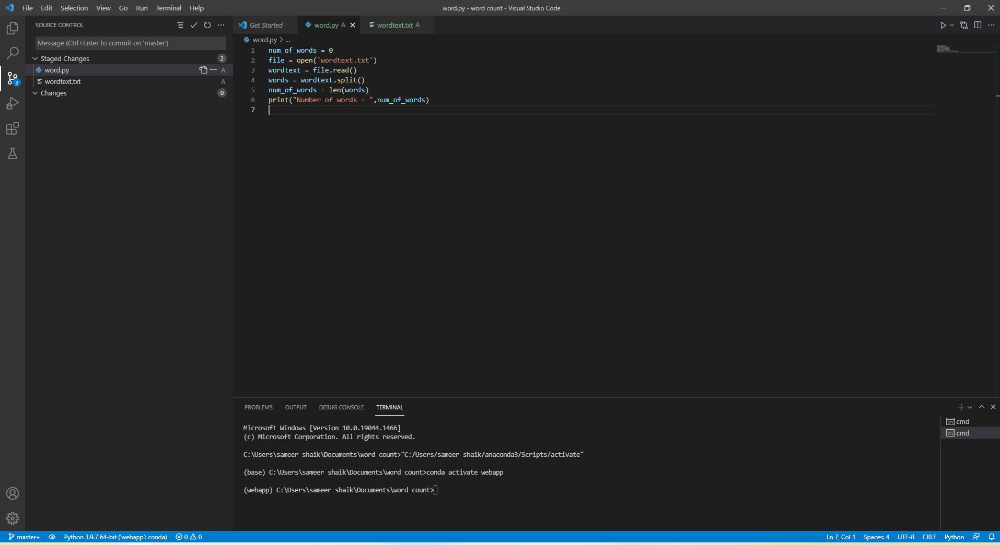
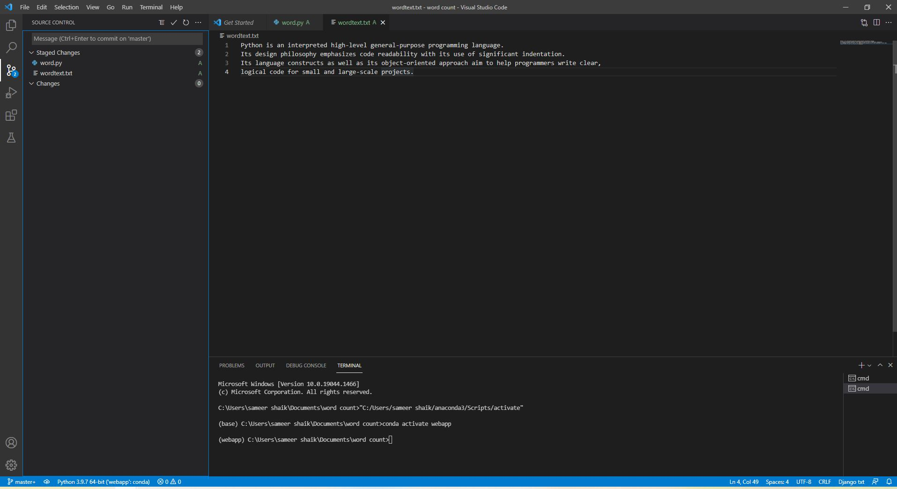

# Word-count
## AIM:
To write a python program for getting the word count from a text.
## EQUIPEMENT'S REQUIRED: 
PC
Anaconda - Python 3.7
## ALGORITHM: 
### Step 1: Open visual stdio.

### Step 2:Create file with.py extension. 
 
### Step 3: Start the program

### Step 4:  Write the code

### Step 5: Run terminal for output of the given program

### Step 6: End the program.

## PROGRAM:
```python
## Developed by :Naramala Niharika
## ref no. :21500912
num_of_words = 0
file = open('wordtext.txt')
wordtext = file.read()
words = wordtext.split()
num_of_words = len(words)
print("Number of words = ",num_of_words)
```

### OUTPUT:




## RESULT:
Thus the program is written to find the word count from a text.

